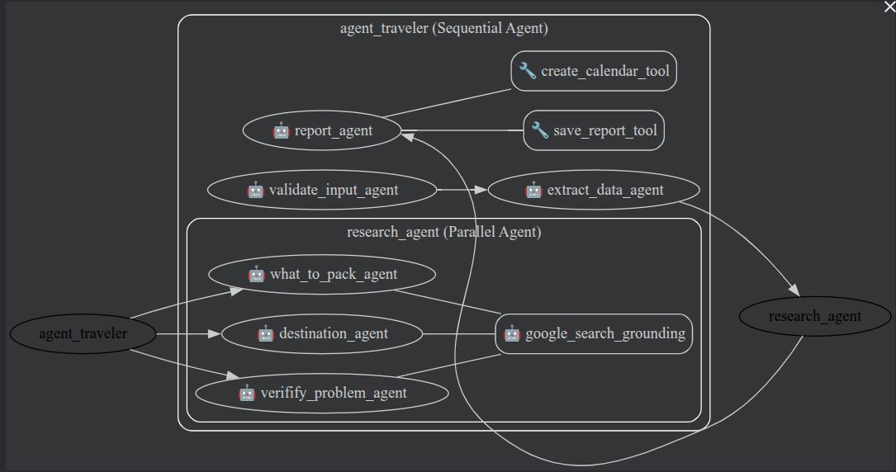

# Señor Mondo Travel Agent

A travel agent to aggregate information from the trip, and deliver a formated and detailed document with details, recomendations and directions to the client.

### The problem

After booking all the flights, hotels, car rents, packages, ..., the travel agent (the real one) has a laborious work. It must get all the information (dates, places, ...), consolidate it in a presentetable document using the agency template, and deliver in a easy and formated way to the client. Also, the agent must create a itinerary, add tips, recommendations, and a brief description of the places that the client will visit.

A direct way to automate this is to connect to diferent systems to retrieve all necessary data, aggregate and create this report. Connect to this system may be impossible for diferent reasons. Sometimes you buy using different travel systems, or directly at the flight/car rent company, or a ticket to a museum/sightseeing. It's not always (most never) you have access to a API the get this information in a structured way. The travel agent must consolidate all this, make a research about the places, and then create the report. This is A LOT of manual work.

There is other services can be added to deliver more value to the client: 
* Create a calendar (like Google Calender) with all the dates and location;
* Create a Map (with Google My Mpas) with all the places (airport, hotels, car rent company) the client must be, and some recommendations where to go (sightseeing, museums, concerts...);
* Program notifications to the client be notified of events.

The time consumed making this tasks could be better used making other, more productive jobs.

### Why agents?

As stated above, it's not possible to connect to all systems to automate the task. But all this system do output a file (generally a PDF file) with all the information. But also parse and get information from unknown source would also be impossible. Here is where we can use agents to extract all the information necessary.

We can create a agent (and sub agents) that will extract the information from different sources (files or even typed at the prompt), aggregate it in a structured format (JSON), and from there, make all the research from the places that will be visited, adding tips and recommendations. At last we can create the output document to the client.

To add more value, we can connect the agent to other systems to create a calendar, maps, and also check possible problems (like gaps in booking, missing flights, holydays,...).

### The Solution

To acomplish this task, it was created the follwing workflow:
* Receive and validate data;
* Extract data;
* Make research;
* Format and output results.

The agent traveler starts waiting the user input the data to be extracted. It can be files (one or more) or type at the prompt. After that, it starts a sequential workflow:
* `validate_input_agent`: responsable to receive the inputs and files, and validate that they are valid inputs. The agent must reject if no valid input is received. The model used at this agent must be able to process inputs like PDF, text and others. If everything is OK, it pass to the next agent.
* `extract_data_agent`: Read all inputs and process it. Deliver all the information in structured output format (JSON).
* `research_agent`: this is a parallel agent. It's responsible to make all research based on the inputs of the user. It's compose by the agents above. All then have access the `google_search` tool (wrapped in a `AgentTool`). The agents are as described below:
  * `what_to_pack_agent`: based on the places and activities, gives advices about what to pack for the trip.
  * `destination_agent`: this agent makes a extensive research about the places that will be visited, to later be used at the report. Images, rating, a brief description and highlights about each the location.
  * `verifify_problem_agent`: verify problems or points of attetion, like gaps at booking, missing flights between places, holidays (places can be closed), visa and health requiriments for the countries, and so on.
* `report_agent`: at last, the report agent is responsable to gather all the extracted and researched information and output a document (markdown format). Information like flights, bookings provided as tables, descriptions of the cities and points of interest, "what to pack" list, and points of attetion. At end, it shows the itinerary of the trip ordered by date. As its last job, it call two tools:
    * `save_report_tool`: to save the document as a artifact;
    * `create_calendar_tool`: to create a calendar file (ICS) that can be imported to applications like Google Calendar.

The model selected was [`gemini-2.0-flash`](https://docs.cloud.google.com/vertex-ai/generative-ai/docs/models/gemini/2-5-flash), that can process files like documents, images and many more (this is just a requiriment for the first agent).

### Next steps

The problem exposed here is inspired in a real case. Much more can be done to improve it. Focusing only on this part of the job (the final deliver):
* Handler better invalid inputs;
* Connect to the agency specific system to get infomration about the client and his preferences, to improve research; 
* Connect to some other system to get more data about the specific trip;
* Improve research with other tools like Google Places;
* Connect to other services, like Google Maps, notifications;
* Reports could be created using Google Docs, and use a template of the travel agency.
