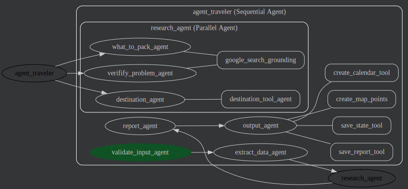

# Señor Mondo Travel Agent

A travel agent to aggregate information from a trip, and deliver a formatted and detailed document with details, recommendations and directions to the client.

> This project was developed to participate the [Agents Intensive Capstone Project Competition](https://www.kaggle.com/competitions/agents-intensive-capstone-project).

> This use case is based on a real requirement.

Video showing use example [here](https://youtu.be/2AdlJB9b7Do).

## Install

### Prerequisites

* [Git](https://git-scm.com/) - Clone the project;
* [uv](https://docs.astral.sh/uv/) - Install and run;

Check the [.env.example](.env.example) file. Copy to [agent_traveler](agent_traveler) directory and rename to `.env`. Put your own API keys at it.

### Install and Run

```bash
# Clone the repository and enter directory
$ git clone https://github.com/rnascunha/agent-traveler
$ cd agent-traveler

# Install dependencies
$ uv sync

# Run
$ uv run adk web
```
Open your browser at [http://127.0.0.1:8000](http://127.0.0.1:8000) and select `agent-traveler` at the dropbox.

Select your travel files and/or add more information to the prompt and hit `Enter`.

## Description

### The problem

After booking all the flights, hotels, car rentals, packages, ..., the travel agent (the real one) has laborious work. It must get all the information (dates, places, etc.), consolidate it in a presentable document using the agency template, and deliver in an easy and formatted way to the client. Also, the agent must create an itinerary, add tips, recommendations, and a brief description of the places that the client will visit.

A direct way to automate this would be to connect to different systems to retrieve all necessary data, aggregate and create the report. Connect to these systems may be impossible for different reasons. Distincts parts of the trip may be bought using distinct travel systems, or directly at the flight/car rent company, or a ticket of a museum/sightseeing on its own site. It's not always (most never) you have access to an API to get this information in a structured way. The travel agent must consolidate all this, make a research about the places, and then create the report. This is A LOT of manual work.

There are other services that can be added to deliver more value to the client:
* Create a calendar (like Google Calendar) with all the dates and location;
* Create a Map (with Google My Maps) with all the places (airport, hotels, car rent company) the client must be, and some recommendations where to go (sightseeing, museums, concerts...);
* Program notifications to the client be alerted of events.

The time consumed making these tasks could be better used making other, more productive jobs.


### Why agents?

As stated above, it's not possible to connect to all systems to automate the task. But all this system outputs a file (generally a PDF file) with all the information. Also, parsing and getting information from unknown sources (unknown PDF structured) would be impossible. Here is where we can use agents to extract all the information necessary.

We can create an agent (and sub agents) that will extract the information from different sources (files or even typed at the prompt), aggregate it in a structured format (JSON), and from there, make all the research from the places that will be visited, adding tips and recommendations. At last, we can create the output document for the client.

To add more value, we can connect the agent to other systems to create a calendar, maps, and also check possible problems (like gaps in booking, missing flights, holidays,...).


### The Solution



To accomplish this task, it was created the following workflow:
* Receive and validate;
* Extract;
* Make research;
* Create report;
* Create and save data in different outputs.

#### Agents

The *agent traveler* starts waiting for the user input the data to be extracted. It can be files (one or more) or type at the prompt. After that, it starts a sequential workflow:
* `validate_input_agent`: responsible to receive the inputs and files, and validate that they are correct inputs. The agent must reject if no valid input is received. The model used at this agent must be able to process inputs like PDF, text and others. If everything is OK, it passes to the next agent.
* `extract_data_agent`: Read all inputs and process it. Deliver all the information in structured output format (JSON).
* `research_agent`: this is a parallel agent. It's responsible to make all research based on the inputs of the user. It's composed by the agents above. All then have access to the `google_search` tool (wrapped in a `AgentTool`). The agents are as described below:
  * `what_to_pack_agent`: based on the places and activities, gives advice about what to pack for the trip.
  * `verifify_problem_agent`: verify problems and/or points of attention, like gaps at booking, missing flights between places, holidays (places can be closed), visa and health requirements for the countries, and so on.
  * `destination_agent`: checks all the places that will be visited. For each location, call the `destination_tool_agent` (an agent tool). This agent makes an extensive research about the places that will be visited (with `google_search_agent`), to later be used in the report. Images, rating, a brief description and highlights about each location (uses `search_images_tool` tool to access stock images database like *Pexels*, *Unsplash* or *Vecteezy*).
* `report_agent`: responsible to gather all the extracted and researched information and output a document (markdown format). Information like flights and bookings provided as tables, descriptions of the cities and points of interest, "what to pack" list, and points of attention. At the end, it shows the itinerary of the trip ordered by date.
* `output_agent`: At last, this agent calls four tools to create/save the outputs based on all the data gathered until now:
   * `save_report_tool`: saves the document as an artifact (`report.md`);
   * `create_map_points`: based on all data, use "Google Places (new) API" to get information like latitude and longitude of all cities, airports, hotels, car rent companies, sightseeing/museums/restaurants researched. Create the KML file and save it (`map.kml`).
   * `create_calendar_tool`: creates a calendar file (ICS) that can be imported to applications like Google Calendar.
   * `save_state_tool`: saves the state of the agent workflow run. This ainformation can be put in a database to be reused, or used for evaluation/debugging of the "agent traveler".

#### Model

The model selected was [`gemini-2.0-flash`](https://docs.cloud.google.com/vertex-ai/generative-ai/docs/models/gemini/2-5-flash), that can process files like documents, images and many more. This is just a requirement for the first agent (`validate_input_agent`), but was used on all agents.

### Next steps

The problem exposed here is inspired by a real case. Much more can be done to improve it. Focusing only on this part of the job (the final deliver):
* Handle better invalid inputs;
* Connect to the agency specific system to get information about the client and his preferences, improving client data;
* Connect to specific travel system (like TripAdvisor) to improve research;
* Connect to other services, like Google Maps, Google Calendar, notifications. Not just output files to be imported;
* Reports could be created using Google Docs, and use a template of the travel agency, adding logos, photos researched;
* Save all the outputs to a persistent storage (like Google Storage).

To use this solution in production, it’s necessary to do an exhaustive evaluation. The solution still fluctuates. Is necessary to improve the prompts of the agents, and a systematic evaluation in a CI/CD environment.
